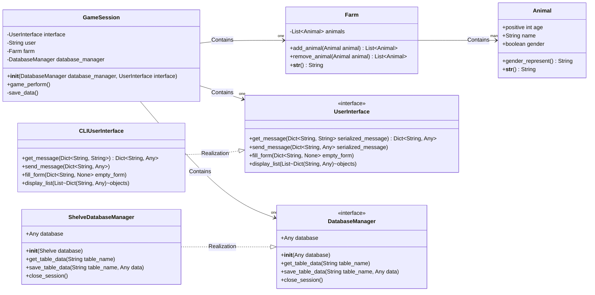

# Roadmap for funny_farm project

## v 0.1.0

1) Animal with gender, age and name. Can be displayed.
2) create and remove animals from farm
3) display list of animals (CLI only)
4) save results of game session in database (Shelve module)

## Class diagram for LATEST version
